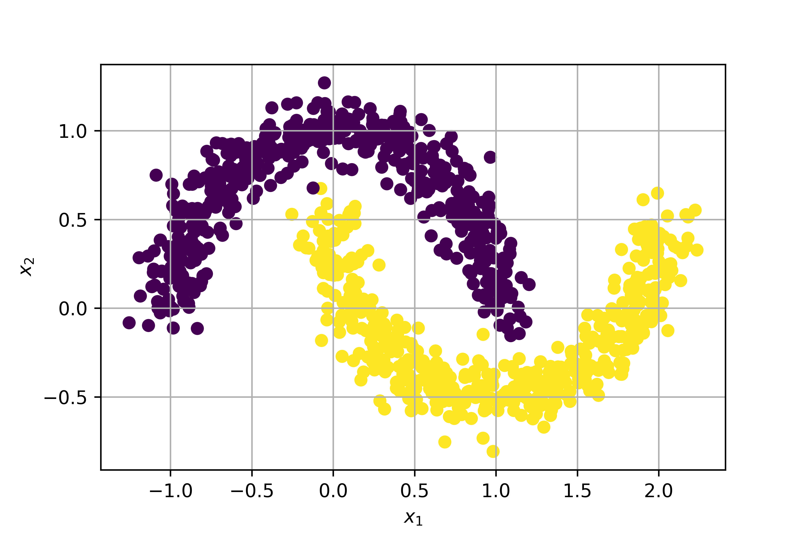
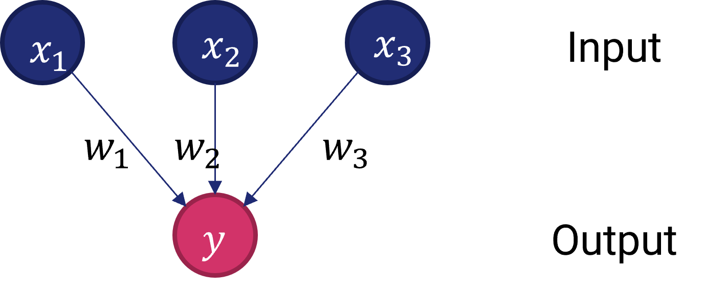
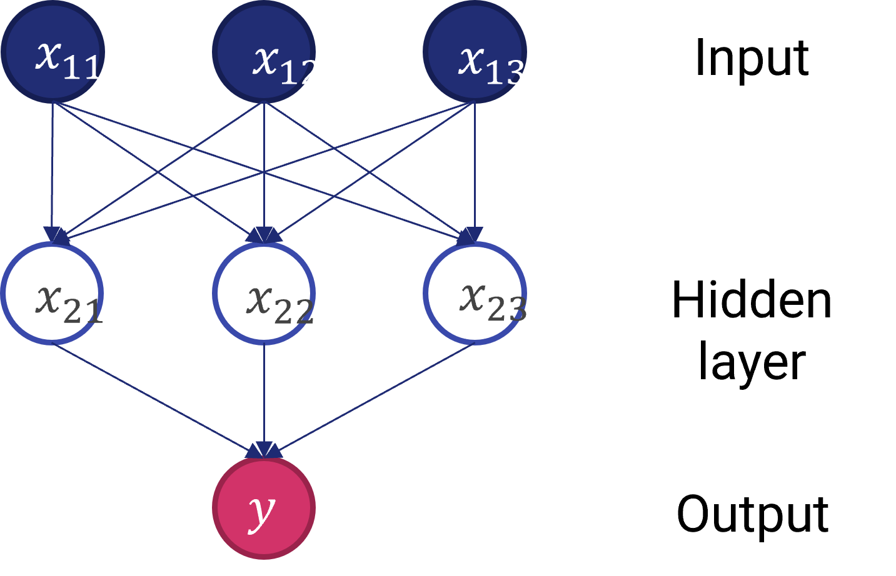
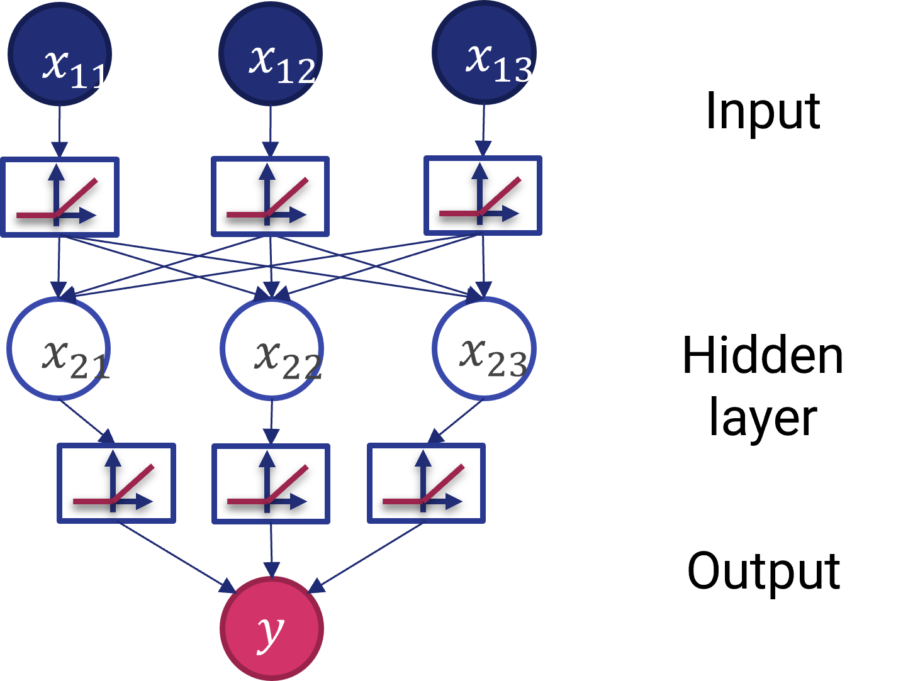

Le reti neurali sono ormai sulla bocca di tutti: chiunque le usa per risolvere con (apparente) successo ogni tipo di problema. Tuttavia, prima di usarle, è opportuno comprendere effettivamente a cosa servano.

Per farlo, non possiamo non partire dall'introdurre il tipo di problemi per risolvere i quali le reti neurali sono state progettate, ovvero i *problemi non lineari*.

## Problemi non lineari

Diamo uno sguardo al dataset rappresentato in figura 1.

<figure markdown>
  { width="600" }
  <figcaption>Figura 1 - Dataset non lineare</figcaption>
</figure>

Un dataset di questo tipo è, evidentemente, *non lineare*. In altre parole, questo significa che non esistono algoritmi in grado di trovare una funzione lineare (ovvero, una retta) che separi i punti appartenenti alle due classi. In termini analitici, non esiste un modello nella forma:

$$
y = ax_1 + bx_2 + c
$$

che permetta di determinare $y$ a partire dai valori $x_1$ ed $x_2$.

!!!note "Numero di feature"
    Ovviamente, abbiamo considerato due feature per semplicità rappresentativa. Nel caso il numero di feature fosse più alto, il modello lineare dovrebbe considerare un numero più elevato di variabili indipendenti.

Potremmo pensare a questo punto di utilizzare un'approssimazione lineare a tratti che, nel caso precedente, sarebbe di grande aiuto nella risoluzione del problema. Tuttavia, consideriamo per un attimo la situazione illustrata in figura 2.

<figure markdown>
  { width="600" }
  <figcaption>Figura 2 - Dataset estremamente non lineare</figcaption>
</figure>

In quest'ultimo caso è evidente come i dati non siano in alcun modo linearmente separabili. E' quindi necessario utilizzare un approccio adeguato.

## Reti neurali e problemi non lineari

Per capire come le reti neurali ci aiutino a risolvere un problema non lineare, partiamo da un semplice sommatore pesato, mostrato in figura 3.

<figure markdown>
  { width="600" }
  <figcaption>Figura 3 - Un sommatore lineare</figcaption>
</figure>

Il sommatore lineare ha tre ingressi, che vengono combinati secondo una qualche terna di pesi $(w_1, w_2, w_3)$ per ottenere un singolo output. In pratica, l'uscita sarà data dalla seguetne relazione:

$$
y = w_1 x_1 + w_2 x_2 + w_3 x_3 + b
$$

Da notare come sia stato aggiunto un contributo $b$ legato ad un termine opzionale di *bias*. Proviamo adesso ad aggiungere uno strato intermedio (o *nascosto*) tra l'ingresso e l'uscita, ottenendo lo schema mostrato in figura 2.

<figure markdown>
  { width="600" }
  <figcaption>Figura 4 - Un sommatore con uno strato nascosto</figcaption>
</figure>

Lo strato nascosto (*hidden layer*) rappresenta una serie di valori intermedi considerati dal sommatore nel calcolo dell'output. In pratica:

* ogni nodo dello strato nascosto sarà dato da una somma pesata dei nodi dell'input;
* l'output sarà dato da una somma pesata dei nodi appartenenti allo strato nascosto.

E' importante sottolineare come ogni "freccia", o per meglio dire *connessione*, abbia uno specifico peso associato.

Nonostante queste modifiche, il modello rimane comunque lineare: in altre parole, potremo aggiungere un numero arbitrario di nodi e strati nascosti, ma l'uscita sarà sempre una somma pesata (più o meno complessa) dell'ingresso. Ciò però cambia nel momento in cui andiamo a considerare una o più *funzioni di attivazione*.

## Funzioni di attivazione

La modellazione di un problema non lineare prevede l'introduzione di non linearità all'interno del modello: per farlo, dovremo inserire delle funzioni (per l'appunto) non lineari, chiamate *funzioni di attivazione*. Uno schema è mostrato in figura 5.

<figure markdown>
  { width="600" }
  <figcaption>Figura 5 - Rete neurale con funzioni di attivazione</figcaption>
</figure>

Ovviamente, con un maggior numero di strati nascosti l'impatto delle non-linearità diventa maggiore. In questo modo, saremo in grado di inferire delle relazioni anche molto complesse tra gli input e gli output.

Le funzioni di attivazione più utilizzate in passato erano di tipo sigmoidale (simili, per intenderci, alla funzione che abbiamo visto in uscita alla regressione logistica). Attualmente, le funzioni più usate sono le *rectified linear unit*, o *ReLU*, che hanno risultati comparabili in termini di accuratezza del modello alla sigmoidale, ma risultano essere significativamente meno complesse dal punto di vista computazionale.

Le ReLU sono espresse dalla seguente funzione:

$$
y = max(0, x)
$$

che graficamente si traduce in una forma espressa come:

<figure markdown>
  
  <figcaption>Figura 6 - Schema della funzione di attivazione ReLU</figcaption>
</figure>

!!!tip "ReLU nella pratica"
    In pratica, una ReLU "fa passare" soltanto i valori positivi, portando a zero tutti quelli negativi.

Riassumendo:

* una rete neurale è data da un insieme di nodi, o *neuroni*, organizzati in uno o più *strati*;
* ogni neurone è connesso a quelli dello strato successivo mediante dei *pesi*, che rappresentano la "forza" della connessione;
* esiste una funzione di attivazione che trasforma l'uscita di ogni neurone verso lo strato successivo inserendo delle non linearità.

## Formulazione matematica

##### Funzionamento di una rete neurale

Dato un insieme di coppie campione/label nella forma $(x_1, y_1), (x_2, y_2), \ldots (x_n, y_n)$, con $x_i \in \mathbb{R}^n, y_i \in {0, 1}$, una rete neurale con un singolo neurone in un singolo strato nascosto apprende la funzione $f(x)=W_2 g(W_1^T x + b_1)+b_2$, dove $W_1 \in \mathbb{R}^m$ e $W_2, b_1, b_2 \in \mathbb{R}$ sono i parametri del modello.

In particolare, $W_1$ e $W_2$ rappresentano i pesi associati ai neuroni nel layer di input ed in quello nascosto, mentre $b_1$ e $b_2$ rappresentano i bias aggiunti dallo strato di ingresso e quello nascosto; $g(): \mathbb{R} \rightarrow \mathbb{R}$ è la funzione di attivazione.

Per un problema di classificazione binaria, viene utilizzata nell'ultimo strato la funzione logistica:

$$
g(z) = \frac{1}{(1+e^{-z})}
$$

In questo modo, si ottiene un valore d'uscita compresto tra $0$ ed $1$. Per discriminare tra le due possibili classi, viene usata una soglia $\rho=0.5$.

Nel caso di un problema multiclasse, $f(x)$ sarà un vettore ad $n$ dimensioni, con $n$ numero di classi. In questo caso, non viene utilizzata la funzione logistica per l'attivazione, bensì una *softmax*:

$$
softmax(z)_i = \frac{e^{z_i}}{\sum_{l=1}^k e^{z_l}}
$$

dove $z_i$ rappresenta l'$i$-mo elemento dell'ingresso alla softmax, che corrisponde quindi alla classe $i$, e $K$ è il numero totale di classi. Il risultato sarà un vettore contenente le probabilità che il campione $x$ appartenga a ciascuna classe; conseguentemente, l'output sarà la classe con il valore di probabilità più alto.

Nel caso si affronti un problema di regressione, l'output è proprio $f(x)$, per cui la funzione di attivazione diventa semplicemente la funzione identità.

##### Funzione di costo

Così come tutti i classificatori e regressori, anche una rete neurale valuta le proprie performance mediante una funzione di costo. In particolare, nel caso di classificazione, la funzione di costo è data dalla cross-entropia, che nel caso binario è data da:

$$
L(\hat{y}, y, W) = -\frac{1}{n}\sum_{i=0}^n(y_i \ln \hat{y}_i + (1-y_i) \ln (1-\hat{y}_i)) + \frac{\alpha}{2n} \|W\|_2^2
$$

dove $\|W\|_2^2$ è un termine di regolarizzazione L2, ed $\alpha$ parametro che controlla il peso di tale termine.

Nel caso della regressione, viene utilizzato l'errore quadratico medio:

$$
L(\hat{y}, y, W) = \frac{1}{2n} \sum_{i=0}^n \|\hat{y}_i - y_i \|_2^2 + \frac{\alpha}{2n}\|W\|_2^2
$$

##### Aggiornamento dei pesi

Le reti neurali partono con pesi assegnati in maniera casuale, ed hanno l'obiettivo di minimizzare la funzione di costo aggiornando i valori assegnati a tali pesi. Di conseguenza, dopo che il valore della funzione di costo è stato calcolato, viene effettuato il cosiddetto *backward pass*, allo scopo di aggiornare i valori di pesi e bias in modo da ridurre il valore complessivo della funzione di costo.

Dato che gli algoritmi utilizzati sono tutti basati su varianti a discesa di gradiente, sarà il gradiente $\nabla L_W$ ad essere calcolato e sottratto a $W$. In pratica:

$$
W^{i+1}=W^i - \epsilon \nabla L_W^i
$$

dove $i$ è l'epoca di training ed $\epsilon$ è un parametro chiamato *learning rate*.

L'addestramento si interrompe per un certo valore di $i$ o, nei casi più sofisticati, quando il miglioramento in termini di funzione di costo scende al di sotto di una certa soglia.

## Tipi di reti neurale

Esistono molti tipi di rete neurale. Quello che abbiamo descritto in questa lezione è il più generico, e viene comunemente indicato come *rete neurale feed-forward*. Ciò è legato al fatto che in questo tipo di rete l'input "fluisce" verso l'output, a meno del backward pass legato all'aggiornamento dei parametri.

Nelle prossime lezioni vedremo altri tre tipi di rete, ovvero gli autoencoder, le recurrent neural network, e le convolutional neural network, ognuna delle quali ha uno specifico dominio applicativo.
